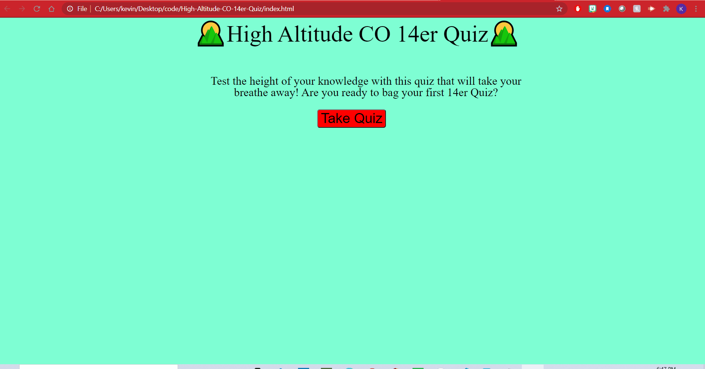

# High-Altitude-CO-14er-Quiz

## Description

Test your knowledge with a quiz that will take your breathe away trying to conquer it.

This quiz will challenge your knowledge on the highest thing in Colorado....the mountains. Lets see if you can bag all 10 questions and reach the summit of a perfect score.

## Installation

No installation required for this site.

## Usage

Begin by clicking on the "Take Quiz" button which will diplay the quiz questions and answers (as buttons). Each question correct will increase the score by 1 (Max: 10 points), and each incorrect score will lower the time remaining by 5 seconds. The end of the quiz will diplay the amount of questions were answered correctly and prompt the user for initials to store their intials and score to diplay on a high scores screen.

## Credits

Kevin Devlin

## License
